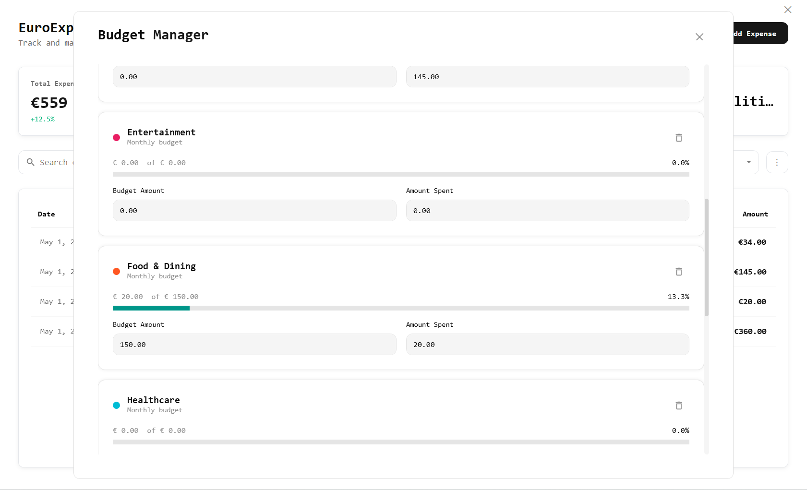
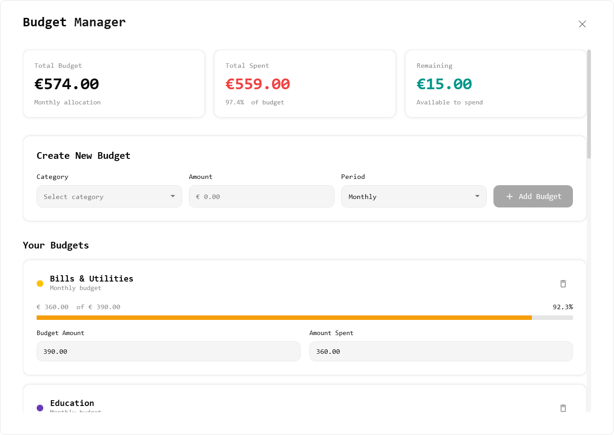
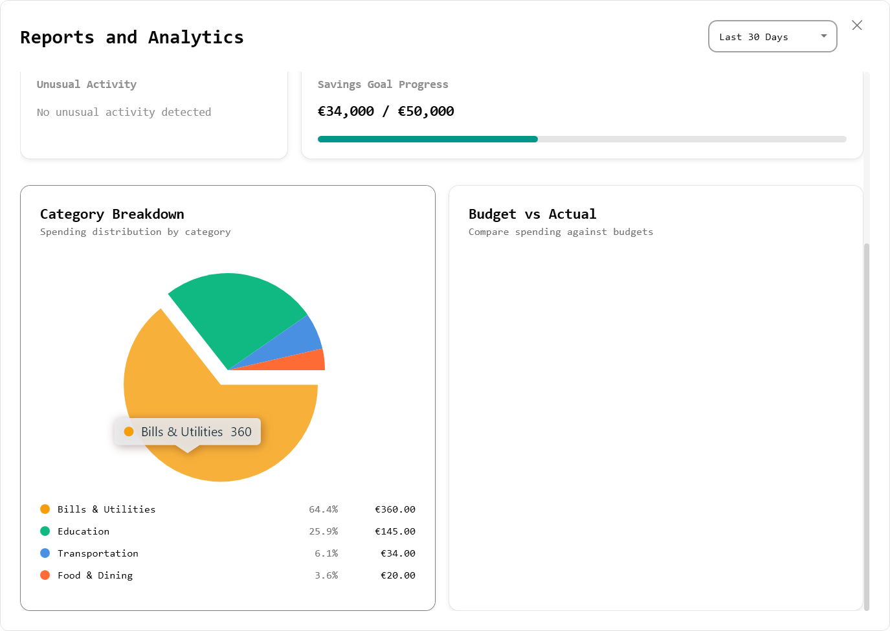
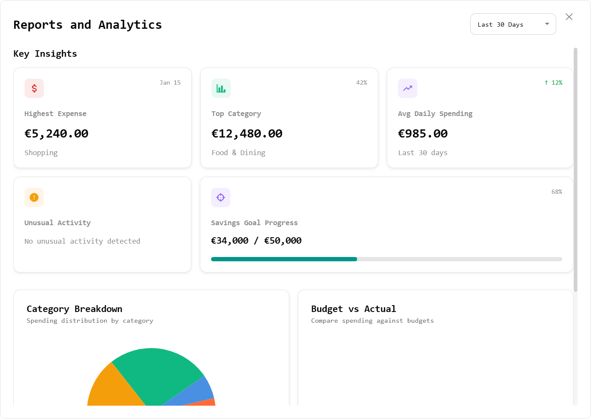

# EuroExpense

A lightweight personal finance tracker built to practice WPF, MVVM, and desktop application development.

EuroExpense is a desktop expense management application built using C# and WPF. It helps users track daily spending, organize expenses, and gain insights into their financial habits through a clean and intuitive interface.

---
## Screenshots

<p align="center">
  
</p>

<br>

<p align="center">
  
  
</p>

<br>

<p align="center">
  
  
</p>

---

## Key Features

* Expense tracking with add, edit, and delete functionality
* Categorization of expenses
* Search and date-based filtering
* Monthly and total expense overview
* Local data storage using SQLite
* Clean WPF-based user interface

---

## Tech Stack

* C#
* WPF (.NET 8)
* MVVM architecture
* SQLite
* Entity Framework Core

---

## Project Structure

```
Views/
ViewModels/
Models/
Services/
Helpers/
```

---

## How to Run

```bash
dotnet restore
dotnet build
dotnet run
```

---

## Highlights

* Implemented MVVM architecture for separation of concerns
* Designed a responsive desktop UI using WPF
* Integrated SQLite database for persistent storage
* Applied clean code practices and structured project organization

---

## Future Enhancements

* Data visualization (charts)
* Budget tracking
* Notifications and reminders
* Export functionality
* Allow users to select a custom date for expenses (currently defaults to the current date)

---

## Author

Dhanush 
